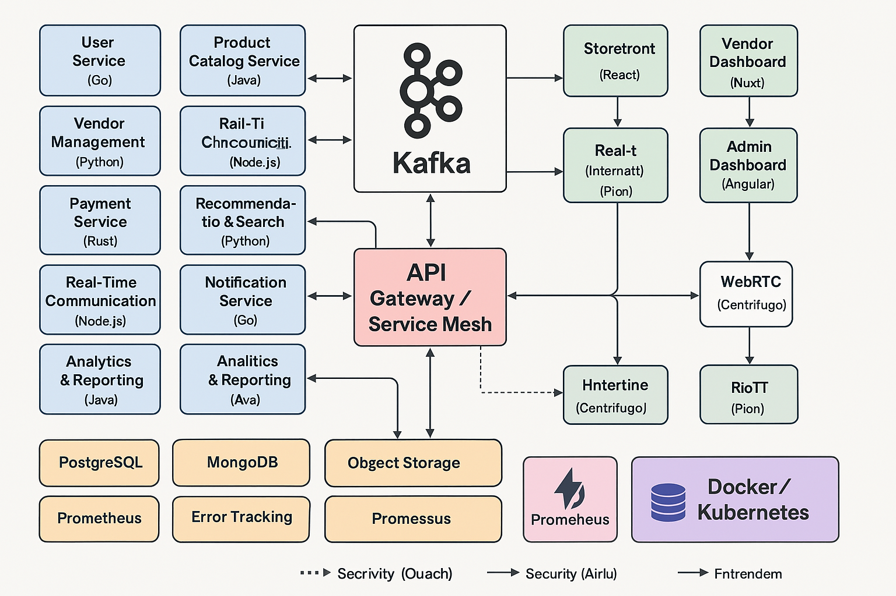

### ✅ **Part 1: Full Architectural Diagram**

**Goal**: High-level visual of the entire system (services, technologies, data flow)

I'll generate a detailed system architecture diagram for:

- Microservices
- Kafka event streams
- gRPC/REST interfaces
- Microfrontends
- Databases
- Monitoring/logging
- Security gateways
- Real-time systems (WebSocket + WebRTC)



Next up: generating the GitHub `README.md` and scaffolding the monorepo/microfrontend structure.

### ✅ Part 2: GitHub `README.md` Structure for Your Mega Project

Here’s a professional and impressive `README.md` layout to show off your architecture,
features, tech stack, and more.

---

```markdown
# 🛍️ MegaCommerce — Full-Stack Distributed E-Commerce Platform

A full-scale, production-grade e-commerce platform built to demonstrate distributed
systems, microservices, microfrontends, event-driven architecture, and scalable infrastructure.

---

## 🌐 Live Demo

🚀 Coming Soon (with Docker Compose + K8s Helm Charts)

---

## 🧩 Features

### User-Facing

- Multi-vendor product catalog
- Real-time chat with vendors
- WebRTC product demos
- Smart recommendations
- Fast, reactive UI (React)

### Admin & Vendor

- Admin moderation dashboard (Angular)
- Vendor store management (Vue + Nuxt)
- Analytics & reporting
- Notifications & auditing

### Infrastructure & Systems

- Microservices (Go, Rust, Java, Node, Python, C++)
- Event-driven (Kafka)
- gRPC & REST APIs
- Real-time via Centrifugo (WebSocket) + Pion (WebRTC)
- PostgreSQL, Redis, ElasticSearch
- Logging (Loki), Tracing (Jaeger), Monitoring (Prometheus)
- Secure OAuth2, JWT, HTTPS, DDoS protection
- Fully containerized with Docker + Kubernetes

---

## 📦 Tech Stack

| Layer      | Tech                                  |
| ---------- | ------------------------------------- |
| Frontend   | React, Vue, Nuxt, Angular, Tailwind   |
| Backend    | Go, Node.js, Rust, Python, Java, C++  |
| APIs       | gRPC, REST, OpenAPI                   |
| Async Comm | Kafka, Centrifugo                     |
| Real-Time  | WebSocket (Centrifugo), WebRTC (Pion) |
| Database   | PostgreSQL, Redis, MongoDB            |
| Logging    | Loki, Fluentd                         |
| Monitoring | Prometheus, Grafana, Sentry, Jaeger   |
| Auth       | OAuth2, JWT, API Keys                 |
| Infra      | Docker, K8s, Helm, Traefik            |
| Dev Tools  | Nx, TurboRepo, Storybook, Swagger     |

---

## 🏗️ System Architecture


---

## 📁 Monorepo Structure
```

megacommerce/
├── apps/
│ ├── web-storefront (React)
│ ├── vendor-dashboard (Nuxt)
│ ├── admin-panel (Angular)
│ └── gateway (API Gateway)
├── services/
│ ├── user-service (Go)
│ ├── product-service (Java)
│ ├── order-service (Node.js)
│ ├── payment-service (Rust)
│ ├── vendor-service (Python)
│ ├── chat-service (Node.js)
│ ├── realtime-service (Go + Centrifugo)
│ ├── rtc-service (Go + Pion)
│ ├── analytics-service (Python)
│ └── notification-service (Rust)
├── shared-libs/
├── infra/
│ ├── k8s/
│ ├── docker/
│ └── helm/
├── scripts/
└── docs/

````
---

## 🚀 Quick Start

```bash
# Run development stack
docker-compose up --build

# Or deploy to local Kubernetes
kubectl apply -f infra/k8s/
````

---

## 🧪 Testing & CI/CD

- Unit, integration & E2E tests (Jest, Playwright, Cypress)
- GitHub Actions for lint/test/build
- Contract testing with Pact
- GitOps with ArgoCD (optional)

---

## 👨‍💻 Contribution

PRs welcome! This project is designed to demonstrate enterprise engineering, feel free
to fork, contribute, or use as a reference.

---

## 📄 License

MIT License

```
---

Next up: ✅ Scaffold the **monorepo and microfrontend** system (in code format). Would you
like the base code as folders + initial configs (Docker, Nx, TurboRepo, package.json, etc.)
in a downloadable format too?
```
